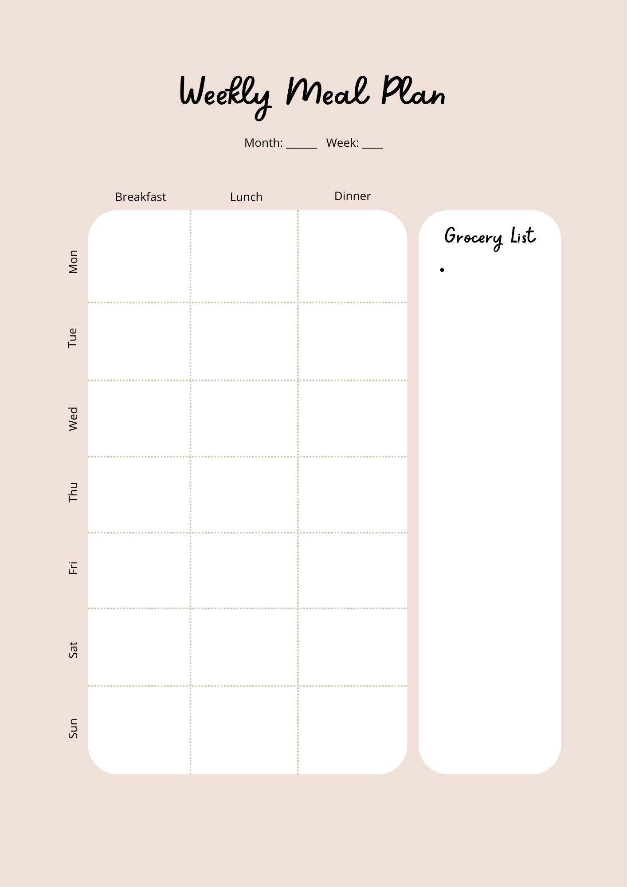
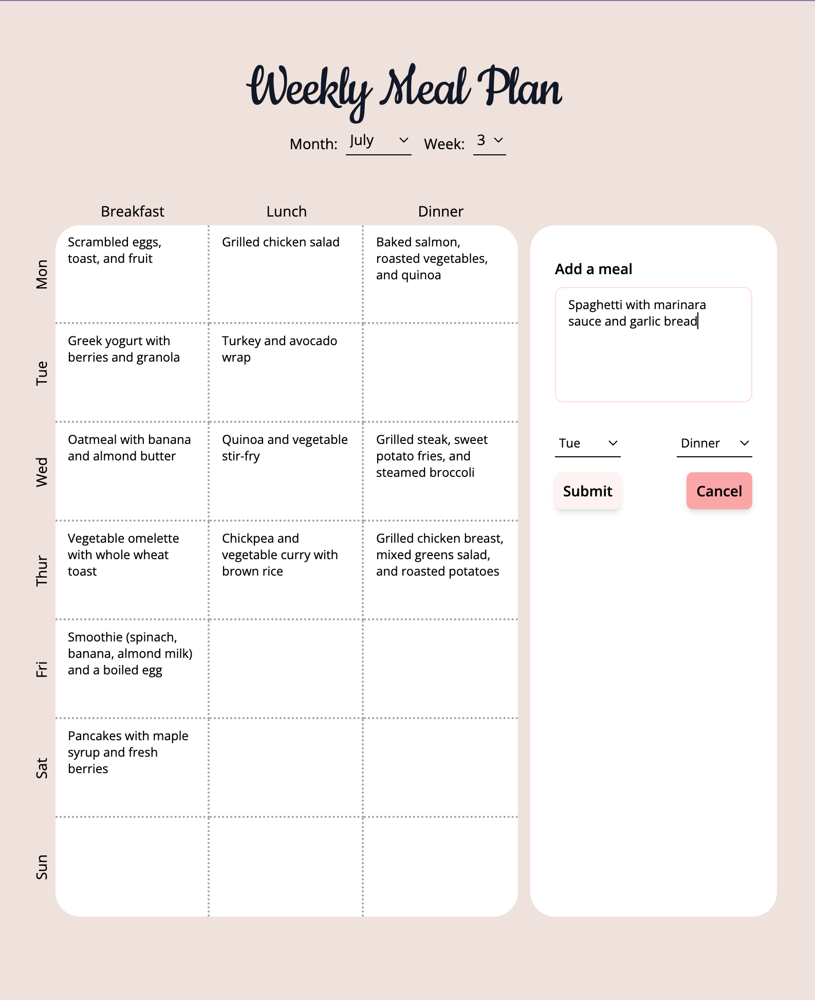
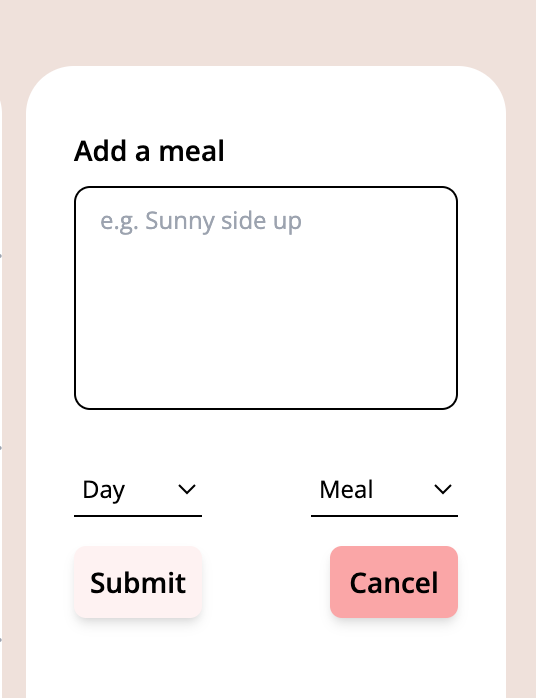
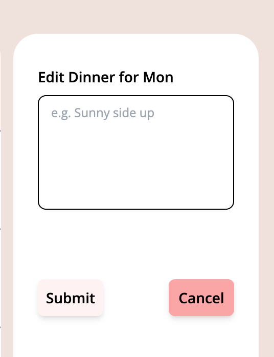
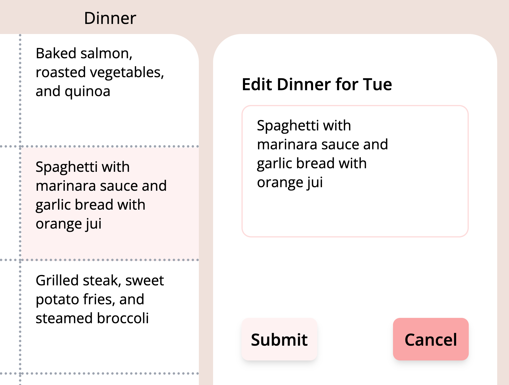

# Weekly Meal Planner React App

This project was bootstrapped with [Create React App](https://github.com/facebook/create-react-app)
Inspired by [Canva](https://www.canva.com/en_gb/)

# 
# Content
* [UI Design](#ui-design)
* [Edit Experience](#edit-experience)
# 

## **UI Design**
The final view of the form allows users to input data into the table, using the sidebar on the right. The user selects the day, meal type and dish, and this is updated to the table in real time

The **Cancel Button** is implemented to reset the input process

Displayed below is the [Canva](https://www.canva.com/en_gb/) inspiration on the left, and final UI on the right:

<section style="text-align: center">
  
  
</section>

#

## **Edit  Experience**
On selecting a box from the table, the sidebar renders an edit form. This form updates the content for the selected box in real time

The **Cancel Button** is again implemented, but this time to **RESET** to reset the box to the **INITIAL** content before edits

<section style="text-align: center">
  
  
  
  
</section>
